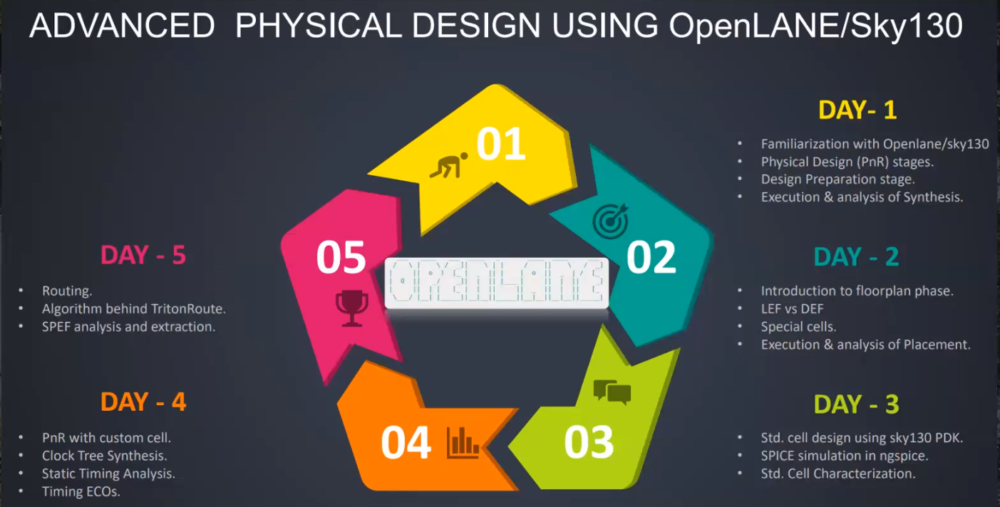
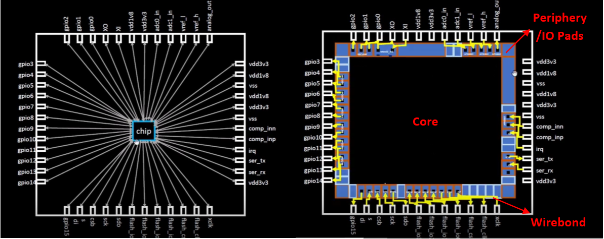
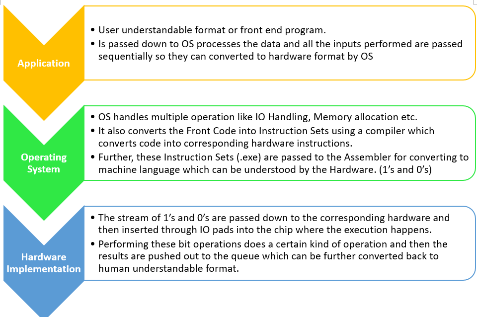

##**Day – 1 Inception of Open-Source EDA, OpenLANE and Sky130 PDK**

**Theory – Fundamentals of SoC**

A simple package board can be represented using a simple block diagram
in which the main brain of the board is it’s Processor/SoC and the SoC
needs to communicate to different blocks like RAM, DRAM, IO’s,
ADC/DAC’s, UART/PCIe etc and for that it must have some output pins
getting connected to each component through a package.

Fig – 1. Simple Block Diagram of a SoC

A simple chip can either be of FlipChip (BGA) or can be of Wirebond
Type. An example of Wirebond is shown in Fig 2(a). These bond wires
connect to the smaller pins of the actual die inside and directly
connect to the IO Pads present at the boundary of the Chip. After
zooming in further Fig 2 can be effectively presented as Fig 2(b) where
the centre region is called Core which contains all the logic and
functionality and the other counterpart is periphery region which
contains all the I/O pads, level shifters, ESD cells etc for
communicating to the outer world.

Fig 2 (a) Actual Structure of SoC with Wirebond (b) Zoomed version of
SoC for depicting connections of SoC to the Die inside marking different
zones of die

Core contains most of the logic of the SoC and it consists of leaf level
instances (RTL Logic), Foundry IP’s and Custom Macro’s. Fig 3 represents
a simple RISC-V architecture based SoC. The chip is partitioned to
different tiles and each area has its own feature/process. Certain goals
and criteria’s like Area, Timing, Power etc are decided and the SoC is
worked thorough different processes in order to match and fine-tune the
top level requirements.

Fig 3. Depiction of different components of a RISC-V Architecture Core

**Theory – Understanding RISC-V Architecture**

RISC-V is an open instruction set architecture and is way through which
we can communicate with the computer. A computer code is initially
converted to its corresponding Assembly Language Program which is
nothing but Hexadecimal code conversion and that is done via RISC-V
Assembly language program which is further converted to 0’s and 1’s
binary language. And these 0’s and 1’s are nothing but digital signal
which can be implemented on the Layout/hardware. An intermediate step
between this conversion is a HDL code/ RTL code which implements the
RISC-V architecture and from which the actual layout can be mapped. Fig
5 explains the whole cycle of communication from Front-End to Binary
Conversion to actual Hardware implementation.

Fig 4 –

Flowchart below (Fig 5) explains the conversion of our day-to-day
applications from Human Understandable Format to Machine Understandable
Format.

Fig 5 –

**Theory – Understanding ASIC Design Flow**

ASIC design stands for Application Specific Integrated Circuits and it
is the methodology of reducing the cost and size of the an electronic
system or SoC. It consists of various components like –

1.  RTL’s or HDL Code – Contains information to represent functionality.

2.  PDK’s – Process Design Kit contains information for manufacturing
    the correct technology.

3.  EDA Tools – Required for simulation and connecting the simulation
    world to actual hardware.

**Process Design Kits**

Process Design Kits is basically a collection of different type of
process data that will be required to manufacture the Hardware based on
the Implemented RTL code. This data is used by different EDA tools to
design an IC. It contains different type of information like –

1.  DRC , LVS , PEX rules

2.  Device Models

3.  Liberties for Cell Characterization

4.  Technology Files depicting the Manufacturing Technology Details

5.  I/O libraries

6.  Design Rule Manual etc.

**Skywater 130nm Open PDK Example**

Skywater 130nm is an open-access PDK created by Google and skywater,
enabling complete ASIC design process to be open-source. Lower
Technology nodes are encrypted and are not openly available in market
yet but it doesn’t mean 130nm technology is redundant and is not in use.
Actual reality says that 130nm is still used by different companies to
perform automated tasks as manufacturing of 130nm is relatively much
cheaper and it can readily used in places which doesn’t operate at High
Speeds.

**RTL2GDS ASIC Design Flow**

There are various components of a simple RTL2GDS ASIC design flow and it
converts the RTLs into corresponding GDSII format which is a must for
tapeout by foundries. Fig 6 represents the whole much compressed form of
RTL2GDS flow for simpler understanding. Every stage has its own
importance and functionality which is explained below.

